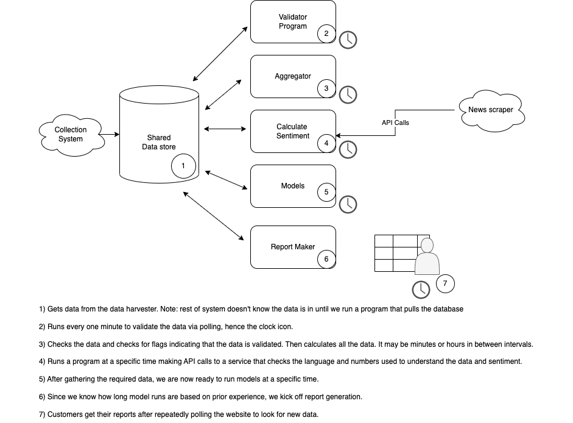
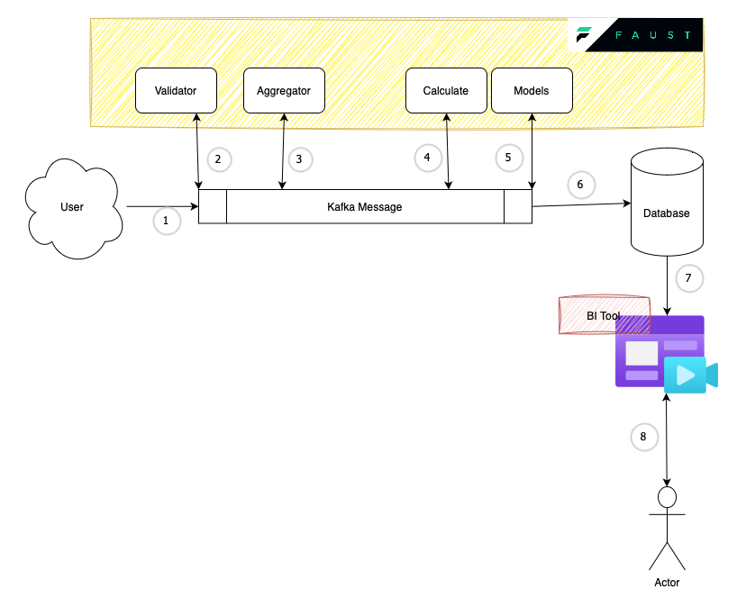

# Event-Driven with Python and Kafka

This repository is based on LiveProject in [Manning](https://www.manning.com/liveprojectseries/data-pipeline-ser)

## Part 1 - Python and Kafka

Using this [docker-compose](https://github.com/bitnami/containers/blob/e1f4cfea7b1d7666c620242ed61cc20cb32f3b69/bitnami/kafka/docker-compose.yml)

Check connection to Kafka

```bash
nc -zv localhost 9092
```
Check connection to Zookeeper

```bash
nc -zv localhost 2181
```

Producer

```bash
docker-compose exec -it kafka /opt/bitnami/kafka/bin/kafka-console-producer.sh --bootstrap-server localhost:9092 --producer.config /opt/bitnami/kafka/config/producer.properties --topic test
```

Consumer

```bash
docker-compose exec -it kafka /opt/bitnami/kafka/bin/kafka-console-consumer.sh --bootstrap-server localhost:9092 --topic test
```

## Part 2 - Observability

Produce message in topic in file hello_word.py. After send we specify the topic and message.

```bash
poetry run faust -A hello_world send hello "Hello Kafka topic"   
poetry run faust -A hello_world send greeting "Greeting Kafka topic2222222" 
```

Start worker

```bash
 poetry run faust -A hello_world worker -l info
```

## Improve architecture



Problems with this architecture

1 - With read/write in database 

2 - If we need to update at least one task we need to stop all other tasks

3 - Since we are working with batch, we can receive a lot of data in the scheduler period, so parts we could need a
lot of computation to complete some tasks

4 - Due to systems being dependent if the first system doesn't finish before the timer, then the second system will be operating with an in complete state.




Explaining the numbers in the new architecture

1 - Receive data from user 

2 - Validate data (using Table in Faust)

3 - Aggregate data (using Table in Faust)

4 - Make a request to external service

5 - Run Machine Learning model

6 - Sink data in Database, could be a data warehouse

7 - Transfer data to BI tool

8 - Acess BI tool to visualization 

In this architecture only write data before we pass all tasks, also can by pass if same data in different
or there is other need. Finnaly, we are working with streaming data so we are dealing with small amount of data

```bash
poetry run faust -A app worker -l info
```


## Part 3 - Automate Reports